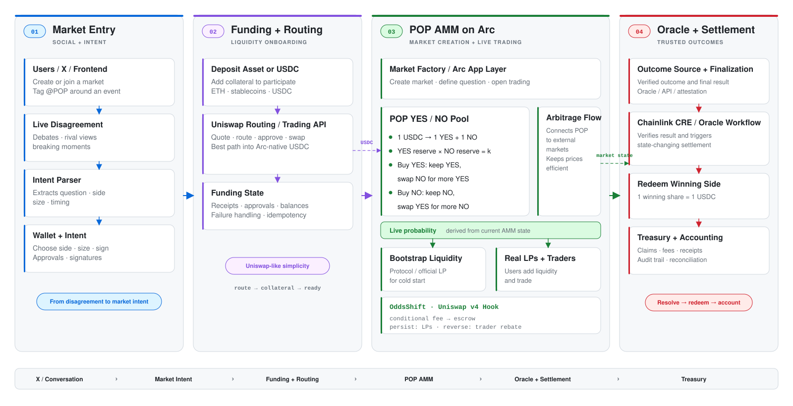

# POP (ex PolyPOP)

> **ETHOnline 2026 — Continuity Track**

**POP is a Uniswap-like AMM prediction market on Arc, using native USDC and powered by Chainlink CRE.**

It enables continuous YES / NO trading, LP liquidity, live probability discovery, and adaptive fee logic during information shocks. POP uses USDC as collateral, Uniswap for liquidity infrastructure, and Chainlink CRE for market resolution.

POP is the continuation of **PolyPOP**, originally built as a social-to-market prediction product. PolyPOP turns live disagreement into prediction markets on X. When users are already arguing, debating with friends, or seeing two clear sides to a question, they can tag `@_PolyPOP` to deploy an onchain prediction market directly from the conversation.

For ETHOnline 2026, we extend that idea deeper into the trading experience. The main upgrade is the transition from a pooled binary prediction market to a **continuously tradable AMM architecture**. PolyPOP made prediction markets easier to create. POP makes them easier to trade with continuous AMM liquidity.


## Links

- Website: [populab](https://populab.xyz/fed)
- X / Twitter: [@populab_xyz](https://x.com/populab_xyz)
- Demo: [ETHGlobal](https://ethglobal.com/showcase/pop-7xzio)
- Uniswap Developer Feedback: [`FEEDBACK.md`](./FEEDBACK.md)


---


## Integration

- **Arc**: USDC, liquidity hub, advanced stablecoin logic, crosschain settlement, app-kit
- **Uniswap**: Trading API routing + v4 AMM / Hook
- **Chainlink**: CRE-based external outcome resolution, ACE Engine, compliant private token transfer


## What's New in ETHOnline 2026

The main upgrade is the transition from a pooled binary market into a continuously tradable AMM.

### New in POP

- AMM-based YES / NO markets
- LP liquidity
- live probability discovery
- fully USDC collateralized outcome positions
- Uniswap v4 Hook for conditional fee-rebate mechanism
- adaptive liquidity during information shocks
- new AMM frontend

### New implementation

- [`contracts-v2/`](./contracts-v2/) — POP AMM + Uniswap v4 + OddsShift
- [`webapp-v2/`](./webapp-v2/) — new AMM frontend

The previous implementation remains in the repository as the continuity base.

---


## Design



## Arc App-Kit Integration

The Arc App-Kit provides the following features:
- Market creation and management
- USDC collateral
- Liquidity provision
- Settlement logic
- Cross-chain support


## Uniswap Integration

- Uniswap provides API routing and Uniswap v4 Hook

## Chainlink Integration

- Chainlink cre workflow
- ACE Engine.
- Compliant private token transfer.

## Main Files


### Arc App-Kit (Prediction Market / Settlement / Cross-chain)

- [`contracts-v2/src/OddsShift.sol`](./contracts-v2/src/OddsShift.sol)  - new prediction market core
- [`contracts/src/BinaryPredictionMarket.sol`](./contracts/src/BinaryPredictionMarket.sol) — core prediction market contract
- [`contracts/src/BinaryPredictionMarketFactory.sol`](./contracts/src/BinaryPredictionMarketFactory.sol) — market factory contract
- [`contracts/src/interfaces/IBinaryPredictionMarket.sol`](./contracts/src/interfaces/IBinaryPredictionMarket.sol) — market interface
- [`contracts/src/interfaces/ReceiverTemplate.sol`](./contracts/src/interfaces/ReceiverTemplate.sol) — cross-chain receiver template
- [`contracts/src/interfaces/IReceiver.sol`](./contracts/src/interfaces/IReceiver.sol) — cross-chain receiver interface
- [`server/src/common/services/settlement.ts`](./server/src/common/services/settlement.ts) — settlement logic
- [`server/src/common/services/claim.ts`](./server/src/common/services/claim.ts) — claim logic
- [`server/src/common/services/bet-listener.ts`](./server/src/common/services/bet-listener.ts) — bet event listener
- [`server/src/common/services/market-data.ts`](./server/src/common/services/market-data.ts) — market data service
- [`webapp/src/lib/bridge.ts`](./webapp/src/lib/bridge.ts) — cross-chain bridge calls
- [`webapp/src/pages/CreatePredictionPage.tsx`](./webapp/src/pages/CreatePredictionPage.tsx) / [`HackathonCreatePage.tsx`](./webapp/src/pages/HackathonCreatePage.tsx) — market creation pages
- [`webapp/src/pages/MarketPage.tsx`](./webapp/src/pages/MarketPage.tsx) / [`HackathonMarketPage.tsx`](./webapp/src/pages/HackathonMarketPage.tsx) — market pages
- [`webapp/src/pages/BetPage.tsx`](./webapp/src/pages/BetPage.tsx) — betting page

### Uniswap (Trading API / v4 Hook)
- [`OddsShiftHook.sol`](./contracts-v2/src/v4/OddsShiftHook.sol) — market creation, YES / NO pools, lifecycle and settlement
- [`OddsShiftHookHelper.sol`](./contracts-v2/src/v4/OddsShiftHookHelper.sol) — one-step buy YES / NO
- [`OutcomeTokenV4.sol`](./contracts-v2/src/v4/OutcomeTokenV4.sol) — YES / NO outcome tokens
- [`ShockFeeMath.sol`](./contracts-v2/src/v4/libraries/ShockFeeMath.sol) — probability and adaptive fee mathematics
- [`webapp/src/lib/uniswap.ts`](./webapp/src/lib/uniswap.ts) — Uniswap integration utilities
- [`webapp/src/lib/uniswapApi.ts`](./webapp/src/lib/uniswapApi.ts) — Uniswap API routing wrapper
- [`webapp/src/pages/SwapPage.tsx`](./webapp/src/pages/SwapPage.tsx) — swap page

### Chainlink (CRE Workflow / ACE Engine / Compliant Private Transfer)
- [`cre-workflow/pop-resolution/main.ts`](./cre-workflow/pop-resolution/main.ts) — CRE workflow main logic
- [`cre-workflow/pop-resolution/workflow.yaml`](./cre-workflow/pop-resolution/workflow.yaml) — CRE workflow config
- [`cre-workflow/project.yaml`](./cre-workflow/project.yaml) — CRE project config
- [`server/src/ace-worker.ts`](./server/src/ace-worker.ts) — ACE Engine worker
- [`server/src/common/aceApi.ts`](./server/src/common/aceApi.ts) — ACE API (server-side)
- [`webapp/src/lib/aceApi.ts`](./webapp/src/lib/aceApi.ts) — ACE API (client-side)
- [`webapp/src/pages/AceClaimPage.tsx`](./webapp/src/pages/AceClaimPage.tsx) — ACE compliant transfer claim page
- [`server/src/common/services/oracle-listener.ts`](./server/src/common/services/oracle-listener.ts) — Chainlink oracle listener
- [`contracts/src/interfaces/AggregatorV3Interface.sol`](./contracts/src/interfaces/AggregatorV3Interface.sol) — Chainlink data feed interface
- [`contracts/src/interfaces/AutomationCompatibleInterface.sol`](./contracts/src/interfaces/AutomationCompatibleInterface.sol) — Chainlink Automation interface


## One-Line Pitch

**POP is an Uniswap-like prediction market on Arc, using native USDC and powered by Chainlink CRE.**

---

## The Problem

Prediction markets are event-driven, but liquidity is often most fragile when information matters most.

Order-book markets depend on active market makers, who can widen spreads, reduce size, or pull quotes during fast moves.

Static pooled prediction markets have another limitation: users cannot continuously enter and exit at a live market price.

---

## The Solution


POP brings the AMM model to prediction markets.

1. **Arc + USDC** provide the collateral and settlement layer.
2. **AMM liquidity** enables continuous YES / NO trading and price discovery.
3. **Uniswap** provides both user-entry routing and a v4 architecture for prediction-market liquidity.
4. **OddsShift Hook** adapts fee economics during information shocks.
5. **Chainlink CRE** provides external outcome resolution.


---

## Demo Flow

### Step 1 — Create a Market

A binary YES / NO prediction market is created.

### Step 2 — Bootstrap Liquidity

USDC provides initial AMM liquidity.

### Step 3 — Trade

Users continuously buy and sell YES or NO.

```text
USDC → YES
USDC → NO
```

### Step 4 — Discover Probability

Trading changes AMM reserves and continuously reprices the market.

```text
50% → 63%
```

### Step 5 — Information Shock

OddsShift monitors how the probability move behaves after the trade.

If the move persists, more of the provisional fee goes to LPs.

If the move reverses, the provisional portion can be rebated to traders.

### Step 6 — Resolve

Chainlink CRE verifies the external result and provides the resolution path.

### Step 7 — Private Redeem

The market closes and the winning outcome becomes redeemable in USDC. If a user wins a large amount, or if protocol revenue grows, the payout enters a **privacy-preserving settlement lane** instead of exposing the full value flow publicly.


